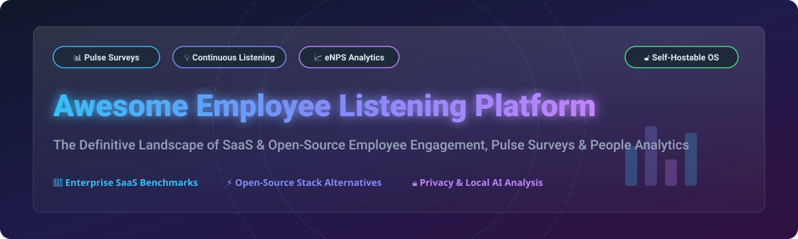

# 🎧 Awesome Employee Listening Platform

<p align="center">
  
</p>

<p align="center">
  <a href="https://github.com/ishandutta2007/Awesome-Awesome-Awesome"></a><a href="https://discord.gg/jc4xtF58Ve"></a> <a href="https://github.com/ishandutta2007/Awesome-Employee-Listening-Platform/stargazers"></a> <a href="https://github.com/ishandutta2007/Awesome-Employee-Listening-Platform/network/members"></a> <a href="https://github.com/ishandutta2007/Awesome-Employee-Listening-Platform/issues"></a> <a href="https://github.com/ishandutta2007/Awesome-Employee-Listening-Platform/blob/main/LICENSE"></a> <a href="https://github.com/ishandutta2007"></a>
</p>

---

## 📌 Ecosystem Overview & Market Insights

> **Market Analysis**: The global **Employee Listening & Experience Platform Market** is estimated at **$6.2 Billion (2026)** and is projected to reach over **$11.8 Billion by 2030** (CAGR ~14.2%). The sector is **moderately fragmented**, featuring dominant enterprise giants alongside agile specialized pulse-survey and continuous-listening innovators.

This curated list tracks leading commercial SaaS platforms and self-hostable open-source building blocks for measuring employee sentiment, running pulse surveys, calculating eNPS, analyzing workplace culture, and driving data-driven people analytics.

---

## 📋 Table of Contents
- [🏢 Enterprise SaaS Platforms](#-enterprise-saas-platforms)
- [🔓 Open-Source GitHub Projects](#-open-source-github-projects)
  - [📋 Survey & Feedback Engines](#-survey--feedback-engines)
  - [🤖 Privacy-Preserving AI & Qualitative Comment Analysis](#-privacy-preserving-ai--qualitative-comment-analysis)
  - [📊 Analytics & Dashboards](#-analytics--dashboards)
  - [💬 Internal Communication & Pulse Distribution](#-internal-communication--pulse-distribution)
  - [⚡ Workflow Automation & Integration Engines](#-workflow-automation--integration-engines)
  - [🗄️ Database & Storage Layer](#-database--storage-layer)
- [🏗️ Self-Hosted Architecture Blueprint](#%EF%B8%8F-self-hosted-architecture-blueprint)
- [🤝 How to Contribute](#-how-to-contribute)
- [💖 Support & Sponsorship](#-support--sponsorship)
- [📈 Star History](#-star-history)
- [⚠️ Disclaimer](#%EF%B8%8F-disclaimer)

---

## 🏢 Enterprise SaaS Platforms

> Sorted by **Company Scale (Revenue / Enterprise Valuation)** in descending order.

| Platform | Company Scale / Valuation | Starting Pricing (Specific Tier) | Free Tier / Free Trial Limits | Core Focus & Features |
| :--- | :--- | :--- | :--- | :--- |
| **Microsoft Viva Glint** | Enterprise Giant ($3 Trillion MSFT) | $6.00 / user / month (Viva Suite / Glint Add-on) | 30-Day Free Trial (Max 25 users) | Integrated employee listening, engagement surveys, manager action planning, organizational analytics. |
| **Workday Peakon** | Enterprise Division ($65 Billion WDAY) | $3.50 / user / month (Peakon Grow starting tier) | 14-Day Enterprise Demo / Free Trial | Continuous listening, engagement analytics, normative benchmarks, lifecycle feedback. |
| **Qualtrics EmployeeXM** | Enterprise Leader ($12.5 Billion Valuation) | $1,500 / year (Core XM Starter tier) | Free Tier (1 survey, 100 responses max) | Enterprise XM platform, pulse surveys, lifecycle listening, AI sentiment analysis. |
| **Lattice** | Unicorn Leader ($3.0 Billion Valuation) | $11.00 / user / month (Engagement + Performance package) | 14-Day Guided Free Trial | People management, employee engagement surveys, eNPS, performance & 360 feedback. |
| **Culture Amp** | Unicorn Leader ($1.5 Billion Valuation) | $4.50 / user / month (Engage Starter plan) | 14-Day Free Trial (Interactive Sandbox) | Employee engagement, pulse surveys, performance, wellbeing, culture benchmarks. |
| **15Five** | Scale-Up Leader ($250 Million Valuation) | $4.00 / user / month (Perform plan) | 14-Day Free Trial (Full feature access) | Continuous check-ins, engagement surveys, 1-on-1s, OKRs, manager effectiveness. |
| **Perceptyx** | Enterprise Growth ($200 Million Valuation) | $3.00 / user / month (Standard listening tier) | 14-Day Guided Demo & Trial | Enterprise continuous listening, custom engagement surveys, barrier analysis. |
| **WorkTango** | Growth Stage ($150 Million Valuation) | $3.00 / user / month (Listen & Survey module) | 14-Day Free Demo & Trial | Engagement surveys, continuous listening, recognition, rewards, sentiment analytics. |
| **Betterworks** | Growth Stage ($120 Million Valuation) | $8.00 / user / month (Starter plan) | 14-Day Guided Free Trial | Performance management, continuous feedback, pulse surveys, goal alignment. |
| **Leapsome** | Growth Stage ($100 Million Valuation) | $8.00 / user / month (Base Modular plan) | 14-Day Free Trial (No credit card required) | Engagement surveys, pulse check-ins, 360 feedback, learning modules, OKRs. |
| **Quantum Workplace** | Established Player ($80 Million Valuation) | $3.50 / user / month (Core Engagement tier) | 14-Day Guided Free Trial | Engagement & pulse surveys, recognition, eNPS, retention risk analytics. |
| **Achievers** | Established Player ($75 Million Valuation) | $4.00 / user / month (Listen & Recognize module) | 14-Day Guided Free Demo & Trial | Employee voice, pulse surveys, continuous recognition, engagement analytics. |
| **Workleap Officevibe** | Scale-Up ($50 Million Valuation) | $3.50 / user / month (Essential plan) | **Free Forever Tier** (Up to 10 team members) | Frequent pulse surveys, eNPS, anonymous feedback, team sentiment tracking. |
| **Vantage Circle** | Growth Stage ($40 Million Valuation) | $2.00 / user / month (Grow plan) | 14-Day Free Trial (Up to 50 employees) | Employee engagement surveys, rewards, recognition, corporate wellness. |
| **SurveyMonkey Enterprise** | Enterprise Leader ($1.5 Billion Revenue) | $25.00 / user / month (Team Advantage tier) | **Free Forever Plan** (10 questions, 40 responses/survey) | Custom employee feedback, HR research surveys, pulse questionnaires. |
| **Jotform** | Major Form Engine ($100 Million Revenue) | $34.00 / month (Bronze tier) | **Free Forever Plan** (5 forms, 100 monthly responses) | HR feedback forms, employee onboarding questionnaires, automated workflows. |
| **Typeform** | Growth Leader ($70 Million Revenue) | $25.00 / month (Basic tier) | **Free Forever Plan** (3 forms, 10 responses/month) | Interactive employee surveys, pulse check-ins, engaging visual feedback. |
| **QuestionPro** | Enterprise Research ($60 Million Revenue) | $99.00 / month (Advanced tier) | **Free Forever Plan** (Unlimited surveys, 200 responses/survey) | Employee experience surveys, workforce analytics, 360 feedback, eNPS. |
| **SurveySparrow** | Growth Stage ($30 Million Revenue) | $19.00 / month (Basic tier) | **Free Forever Plan** (3 active surveys, 50 responses/month) | Conversational employee surveys, 360-degree feedback, eNPS modules. |
| **BambooHR** | HRIS Giant ($150 Million Revenue) | $5.25 / user / month (Advantage Plan with eNPS) | 7-Day Free Trial (Full HR & Survey Suite) | Employee satisfaction surveys, eNPS, performance management, HRIS data. |
| **HiBob (Bob)** | HR Unicorn ($1.6 Billion Valuation) | $6.00 / user / month (Core HR + Survey Add-on) | 14-Day Guided Demo & Trial | HR platform, employee surveys, sentiment tracking, workforce analytics. |
| **PeopleForce** | Growth Stage ($15 Million Valuation) | $2.00 / user / month (PeoplePulse Module) | 14-Day Free Trial (Full platform access) | HRIS, employee pulse surveys, satisfaction tracking, onboarding feedback. |
| **CultureMonkey** | Emerging Leader ($10 Million Valuation) | $2.00 / user / month (Annual plan) | 14-Day Free Trial (Up to 100 survey responses) | Employee engagement surveys, lifecycle pulse, sentiment analysis, eNPS. |
| **Motivosity** | Scale-Up ($25 Million Revenue) | $2.00 / user / month (Listen & Connect module) | 14-Day Free Trial (Up to 25 employees) | Employee recognition, pulse surveys, manager feedback, culture metrics. |
| **Sogolytics** | Growth Stage ($20 Million Revenue) | $25.00 / month (Plus plan) | **Free Forever Plan** (Unlimited surveys, 100 responses/year) | Employee experience surveys, pulse feedback, engagement analytics. |
| **TeamMood** | Bootstrapped Specialist ($2 Million Revenue) | $2.00 / user / month (Standard plan) | 30-Day Free Trial (Full feature access) | Daily mood check-ins, team sentiment metrics, anonymous feedback. |
| **WorkBuzz** | UK Specialist ($8 Million Valuation) | $3.00 / user / month (Listen tier) | 14-Day Free Trial (Frontline focus) | Frontline worker listening, pulse surveys, engagement benchmarks. |

---

## 🔓 Open-Source GitHub Projects

> Open-source projects ranked by **GitHub Star Count** (descending). Each badge links directly to the project's stargazers page.

### 📋 Survey & Feedback Engines
* [](https://github.com/formbricks/formbricks/stargazers) **[Formbricks](https://github.com/formbricks/formbricks)** — Open-source survey & experience management platform with target segmentation, micro-surveys, and feedback analytics.
* [](https://github.com/heyform/heyform/stargazers) **[HeyForm](https://github.com/heyform/heyform)** — Open-source visual form builder and interactive questionnaire platform for employee check-ins.
* [](https://github.com/getfider/fider/stargazers) **[Fider](https://github.com/getfider/fider)** — Open-source feedback management platform ideal for continuous employee suggestion boards, voting, and idea prioritization.
* [](https://github.com/LimeSurvey/LimeSurvey/stargazers) **[LimeSurvey](https://github.com/LimeSurvey/LimeSurvey)** — The premier self-hosted enterprise survey engine supporting complex branching, multi-lingual HR surveys, anonymous responses, and eNPS.
* [](https://github.com/ohmyform/ohmyform/stargazers) **[OhMyForm](https://github.com/ohmyform/ohmyform)** — Lightweight self-hosted form and pulse survey generator.
* [](https://github.com/nextcloud/forms/stargazers) **[Nextcloud Forms](https://github.com/nextcloud/forms)** — On-premise secure survey app integrated into Nextcloud, keeping employee data strictly private.

### 🤖 Privacy-Preserving AI & Qualitative Comment Analysis
* [](https://github.com/ollama/ollama/stargazers) **[Ollama](https://github.com/ollama/ollama)** — Run LLMs locally (Llama 3, Mistral) to summarize employee feedback comments without cloud data leakage.
* [](https://github.com/huggingface/transformers/stargazers) **[Hugging Face Transformers](https://github.com/huggingface/transformers)** — Machine learning models for sentiment analysis, emotion detection, and text classification on employee surveys.
* [](https://github.com/open-webui/open-webui/stargazers) **[Open WebUI](https://github.com/open-webui/open-webui)** — Self-hosted private AI chat interface for People Analytics teams to query employee sentiment data.
* [](https://github.com/danny-avila/LibreChat/stargazers) **[LibreChat](https://github.com/danny-avila/LibreChat)** — Customizable AI interface for analyzing qualitative feedback with local AI models.
* [](https://github.com/scikit-learn/scikit-learn/stargazers) **[scikit-learn](https://github.com/scikit-learn/scikit-learn)** — Machine learning framework for driver analysis, employee attrition risk modeling, and response clustering.
* [](https://github.com/pandas-dev/pandas/stargazers) **[pandas](https://github.com/pandas-dev/pandas)** — Essential Python data manipulation library for aggregating pulse survey scores and eNPS.
* [](https://github.com/explosion/spaCy/stargazers) **[spaCy](https://github.com/explosion/spaCy)** — Industrial-strength NLP library for entity recognition and topic tagging in employee comments.
* [](https://github.com/UKPLab/sentence-transformers/stargazers) **[Sentence Transformers](https://github.com/UKPLab/sentence-transformers)** — Compute dense vector embeddings for semantic clustering of employee feedback.
* [](https://github.com/MaartenGr/BERTopic/stargazers) **[BERTopic](https://github.com/MaartenGr/BERTopic)** — Neural topic modeling technique for discovering recurring themes across open-ended HR surveys.

### 📊 Analytics & Dashboards
* [](https://github.com/grafana/grafana/stargazers) **[Grafana](https://github.com/grafana/grafana)** — Real-time metrics visualization platform for employee pulse tracking and longitudinal trends.
* [](https://github.com/apache/superset/stargazers) **[Apache Superset](https://github.com/apache/superset)** — Enterprise BI web application for deep demographic segmentation and employee engagement dashboards.
* [](https://github.com/metabase/metabase/stargazers) **[Metabase](https://github.com/metabase/metabase)** — Simple self-hosted business intelligence tool for non-technical HR leaders to explore survey data.
* [](https://github.com/plotly/plotly.py/stargazers) **[Plotly Py](https://github.com/plotly/plotly.py)** — Interactive chart generation for organizational heatmaps and sentiment distribution.
* [](https://github.com/jupyterlab/jupyterlab/stargazers) **[JupyterLab](https://github.com/jupyterlab/jupyterlab)** — Interactive computing notebook environment for People Data Scientists.

### 💬 Internal Communication & Pulse Distribution
* [](https://github.com/discourse/discourse/stargazers) **[Discourse](https://github.com/discourse/discourse)** — Modern community discussion forum for open company-wide discussions and workplace culture feedback.
* [](https://github.com/rocketchat/Rocket.Chat/stargazers) **[Rocket.Chat](https://github.com/rocketchat/Rocket.Chat)** — Open team chat server for deploying interactive survey bots and quick pulse questions.
* [](https://github.com/appsmithorg/appsmith/stargazers) **[Appsmith](https://github.com/appsmithorg/appsmith)** — Low-code platform to quickly build custom internal HR action-planning portals.
* [](https://github.com/ToolJet/ToolJet/stargazers) **[ToolJet](https://github.com/ToolJet/ToolJet)** — Open-source low-code framework to build custom employee listening administration tools.
* [](https://github.com/mattermost/mattermost/stargazers) **[Mattermost](https://github.com/mattermost/mattermost)** — Secure collaboration platform for distributing workplace pulse notifications.
* [](https://github.com/nextcloud/server/stargazers) **[Nextcloud Server](https://github.com/nextcloud/server)** — Self-hosted productivity suite hosting internal employee forms and survey files.
* [](https://github.com/budibase/budibase/stargazers) **[Budibase](https://github.com/budibase/budibase)** — Turn survey data into action-tracking apps for HR managers.
* [](https://github.com/element-hq/element-web/stargazers) **[Element](https://github.com/element-hq/element-web)** — Matrix-based end-to-end encrypted messaging client for anonymous feedback delivery.
* [](https://github.com/matrix-org/synapse/stargazers) **[Matrix Synapse](https://github.com/matrix-org/synapse)** — Decentralized communication server for private employee feedback channels.
* [](https://github.com/openedx/edx-platform/stargazers) **[Open edX](https://github.com/openedx/edx-platform)** — Connect survey feedback with targeted employee training and learning paths.
* [](https://github.com/moodle/moodle/stargazers) **[Moodle](https://github.com/moodle/moodle)** — Open-source learning management platform featuring feedback modules.

### ⚡ Workflow Automation & Integration Engines
* [](https://github.com/n8n-io/n8n/stargazers) **[n8n](https://github.com/n8n-io/n8n)** — Fair-code workflow automation tool to connect LimeSurvey with Slack, Teams, and HRIS databases.
* [](https://github.com/apache/airflow/stargazers) **[Apache Airflow](https://github.com/apache/airflow)** — Orchestrate complex ETL pipelines for employee survey data ingestion and demographic sync.
* [](https://github.com/keycloak/keycloak/stargazers) **[Keycloak](https://github.com/keycloak/keycloak)** — Single Sign-On (SSO) and identity management for securing employee listening portals.
* [](https://github.com/apache/kafka/stargazers) **[Apache Kafka](https://github.com/apache/kafka)** — Distributed event streaming platform for real-time employee experience signal processing.
* [](https://github.com/apache/flink/stargazers) **[Apache Flink](https://github.com/apache/flink)** — State-of-the-art real-time stream analytics for ongoing workplace pulse scoring.
* [](https://github.com/activepieces/activepieces/stargazers) **[Activepieces](https://github.com/activepieces/activepieces)** — Open-source no-code automation engine for HR workflows.
* [](https://github.com/node-red/node-red/stargazers) **[Node-RED](https://github.com/node-red/node-red)** — Low-code event-driven wiring tool for custom feedback triggers.

### 🗄️ Database & Storage Layer
* [](https://github.com/supabase/supabase/stargazers) **[Supabase](https://github.com/supabase/supabase)** — Open-source Firebase alternative powering custom employee listening backend web apps.
* [](https://github.com/dani-garcia/vaultwarden/stargazers) **[Vaultwarden](https://github.com/dani-garcia/vaultwarden)** — Lightweight password management for securing administrative HR credentials.
* [](https://github.com/postgres/postgres/stargazers) **[PostgreSQL](https://github.com/postgres/postgres)** — The gold-standard open relational database for storing anonymized employee survey responses.

---

## 🏗️ Self-Hosted Architecture Blueprint

Organizations prioritizing privacy and data sovereignty can assemble a production-grade Employee Listening stack using open-source components:

```
[ 📋 Pulse & Survey Collection ] -> ( LimeSurvey / Formbricks / Nextcloud Forms )
                                              │
[ ⚡ Workflow & HRIS Sync ]       <- ( n8n / Airflow / Keycloak SSO )
                                              │
[ 🗄️ Secure Storage Layer ]      -> ( PostgreSQL / Supabase )
                                              │
[ 🤖 Local AI & NLP Analytics ]  -> ( Ollama + Open WebUI / BERTopic / spaCy )
                                              │
[ 📊 BI & Executive Dashboards ] -> ( Apache Superset / Metabase / Grafana )
```

---

## 🤝 How to Contribute

Contributions are highly welcome! Please follow these simple steps:
1. **Fork** this repository.
2. Add your suggested **SaaS Platform** (with specific pricing & free tier limits) or **Open-Source GitHub Project** to the appropriate section.
3. Ensure open-source projects include their official GitHub repository URL.
4. Submit a **Pull Request** with a brief summary of why the tool belongs in this list.

Refer to the curated list standards in [Awesome-Awesome-Awesome](https://github.com/ishandutta2007/Awesome-Awesome-Awesome).

---

## 💖 Support & Sponsorship

If you find this repository valuable for your HR operations, People Analytics research, or open-source stack building, please consider supporting the project!

- ⭐ **Star** this repository to increase its visibility.
- 🔀 **Fork** it to customize for your team's internal architecture.
- 📢 **Share** it with fellow HR Leaders, People Analysts, and Engineering Teams.
- ☕ **Buy Me a Coffee**: Support ongoing open-source curation and maintenance via the [GitHub Sponsor Dashboard](https://github.com/sponsors/ishandutta2007).

Thank you for helping make workplace listening more open, transparent, and data-driven! ❤️

---

## 📈 Star History

[](https://star-history.dera.page/#ishandutta2007/Awesome-Employee-Listening-Platform&type=date&legend=top-left)

---

## ⚠️ Disclaimer

- This curated repository is for informational and educational purposes only and does not constitute formal procurement endorsement.
- SaaS pricing, features, valuations, and free tier limits are based on publicly available data as of September 2026 and are subject to change by respective vendors.
- Open-source survey deployments require careful security auditing regarding employee data privacy, access permissions, and anonymization controls.
